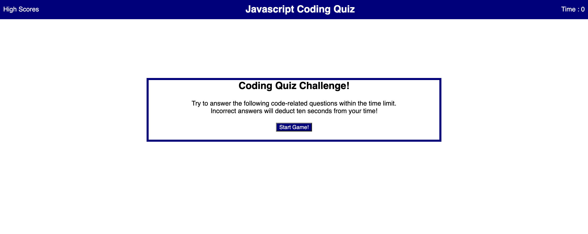

# code-quiz

## Description

site Url https://jtpheonix13.github.io/code-quiz

The goal of this challenge was to build a code quiz
from scratch using HTML CSS and JavaScript Dom API manipulation.

## Steps Taken

1. I wrote out the index.html file for the main page
2. I wrote the script.js file to use the DOM to pull elements from the html
and dynamically change them using javascript DOM methods
3. I wrote the style.css page to size and position the elements
4. I then wrote the highscores.html page for the page displaying the highscore
5. I wrote a highscores.js page to give the highscores page functionality
6. I added style rules to the stylesheet for the highscores.html page

### site screenshot

